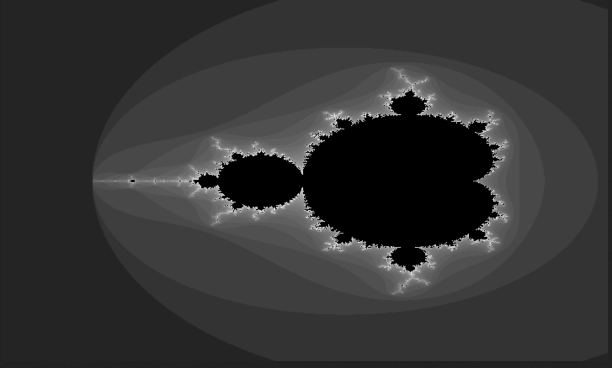

# Stu Workers

A Cloudflare Worker that demonstrates a variety of features.


## Features

- `/fractal` Generates Mandelbrot and Julia set fractals
- `/ndjson-to-json` NDJSON to JSON conversion endpoint (limited to certain hostnames)
- `/xml-to-json` XML to JSON conversion endpoint (limited to certain hostnames)
- `/poll/app?id=<poll-id>` Single-page voting UI for an existing poll
- `/poll/admin` (auth required) returns all polls with totals; `/poll/admin/delete` deletes a poll; `/poll/admin/spa` serves an admin UI (pass API key via `key` query or header); `/poll/admin/save` creates or updates a poll
- Poll data is stored in D1 (bind as `DB` in `wrangler.toml`)

## Endpoints

### /fractal



Generates fractals (Mandelbrot and Julia sets) on demand. The worker creates grayscale images in either BMP or PNG format.

#### Parameters
- `width`: Image width (default: 720, max: 800 for BMP, 320 for PNG)
- `height`: Image height (default: 432, max: 600 for BMP, 200 for PNG)
- `seed`: Random seed for reproducible generation (default: random)
- `type`: Fractal type ('mandelbrot' or 'julia', default: random)
- `iter`: Number of iterations (default: 50)
- `bmp`: Use BMP format if 'true', PNG if 'false' (default: true)

### /status
Returns a simple status message indicating the worker is running

### /ndjson-to-json
Converts NDJSON to JSON format 

Some log streaming and event services use NDJSON format since it is streamable, does not require closing `}` at the end of the fole and is human readable. 

NDJSON is seperated by newlines and each line is a JSON object.

Example NDJSON:
```json
{"key1":"value1"}
{"key2":"value2"}
```

Compare to JSON:
```json
{"key1":"value1","key2":"value2"}
```

This endpoint expects a URL which returns JSON returns this as JSON.

### /poll

Endpoints for creating and voting in polls (e.g. for deciding what's for dinner).

#### /poll/new
Creates a new poll with options and voting timeframe.
- Accepts a `question` string plus `options` array; defaults to "Untitled poll" if not provided.
- Optional `durationSeconds` (default 30) used by the SPA countdown.

Example request:
```json
POST /poll/new
{
    "question": "What should we have for dinner?",
    "durationSeconds": 30,
    "options": [
        {"name": "Pizza", "url": "https://example.com/pizza"},
        {"name": "Sushi", "url": "https://example.com/sushi"},
        {"name": "Tacos", "url": "https://example.com/tacos"}
    ],
    "open": "2024-03-20T18:00:00Z",  // Optional, defaults to now
    "close": "2024-03-20T20:00:00Z"  // Optional, defaults to 24h from creation
}
```

Response:
```json
{
    "id": "123e4567-e89b-12d3-a456-426614174000",
    "question": "What should we have for dinner?",
    "durationSeconds": 30,
    "open": "2024-03-20T18:00:00Z",
    "close": "2024-03-20T20:00:00Z",
    "options": [
        {"name": "Pizza", "url": "https://example.com/pizza", "votes": 0},
        {"name": "Sushi", "url": "https://example.com/sushi", "votes": 0},
        {"name": "Tacos", "url": "https://example.com/tacos", "votes": 0}
    ]
}
```

#### /poll/vote
Vote for an option in an existing poll.

Example request:
```json
POST /poll/vote
{
    "pollId": "123e4567-e89b-12d3-a456-426614174000",
    "optionIndex": 0  // Vote for the first option (Pizza)
}
```

Response:
```json
{
    "id": "123e4567-e89b-12d3-a456-426614174000",
    "question": "What should we have for dinner?",
    "durationSeconds": 30,
    "open": "2024-03-20T18:00:00Z",
    "close": "2024-03-20T20:00:00Z",
    "options": [
        {"name": "Pizza", "url": "https://example.com/pizza", "votes": 1},
        {"name": "Sushi", "url": "https://example.com/sushi", "votes": 0},
        {"name": "Tacos", "url": "https://example.com/tacos", "votes": 0}
    ]
}
```
- Voting is limited to one vote per client fingerprint (hashed IP/User-Agent), enforced via KV markers per poll.
- `/poll/app?id=<poll-id>` serves an inline HTML/JS SPA to load a poll, cast a vote, and view results; it counts down to the poll's `close` time (fallback to `durationSeconds`, default 30), hides per-option counts until a brief drum roll finishes, then reveals totals sorted top-first.
- `/poll/reset` resets an existing poll (auth required): sets `open` to now, `close` to now + `durationSeconds`, zeroes all votes, and clears voter markers so users can vote again. Body: `{ "pollId": "<id>" }`
- `/poll/admin` (auth required) returns all polls with totals; `/poll/admin/delete` deletes a poll; `/poll/admin/spa` serves an admin UI (pass API key via `key` query or header)

## Examples 

### Fractal Generation
- BMP format: /fractal?width=800&height=600&seed=12345&type=mandelbrot&iter=100
- PNG format: /fractal?width=320&height=200&seed=67890&type=julia&iter=50&bmp=false

### Status Check
GET /status

### NDJSON Conversion
- /ndjson-to-json?url=https://ntfy.sh/FdKwILjQxxHWZ26u/json?poll=1&since=1h

## Limitations
- The BMP format is limited to 800x600 pixels
- The PNG format is limited to 320x200 pixels
- The number of iterations is limited to 800
- You may be rate limited, please do not abuse the service.

## Running Locally

To run this project locally, follow these steps:

0. **Create D1 database** (one-time, for production deploys):
   ```bash
   npx wrangler d1 create stu-workers
   ```
   Copy the `database_id` into `wrangler.toml` under the `DB` binding. Local `wrangler dev --local` will use an embedded SQLite shim automatically.

1. **Install Wrangler CLI** if you haven't already:
   ```bash
   npm install -g wrangler
   ```

2. **Clone the repository** and install dependencies:
   ```bash
   git clone <repository-url>
   cd stu-fractal-worker
   npm install
   ```

3. **Start the development server**:
   ```bash
   wrangler dev
   ```

This will start a local development server, typically at `http://127.0.0.1:8787`. Any changes you make to the code will be automatically reflected.

### Poll API local demo

Run `scripts/poll-api-demo.sh` to spin up `wrangler dev --local`, seed a sample poll, cast a vote, and dump the JSON results. The script:
- pulls `MASTER_KEY` from your shell or `wrangler.toml`, generates a valid API key using the same HMAC logic as `src/middleware/validateApiKey.js`, and sends it in `X-API-Key`
- forces `ENVIRONMENT=development`/`NODE_ENV=development` bindings for local runs
- persists KV data to `.wrangler/state` so you can rerun and inspect stored polls
- writes wrangler logs to `/tmp/stu-workers-wrangler.log` while streaming curl responses to the console
- casts sample votes showing duplicate rejection for the same fingerprint and acceptance for a different fingerprint, then dumps JSON results
- calls `/poll/reset` (authenticated) to zero votes and restart the timer, then prints reset results

Set `MASTER_KEY` for local runs by either exporting it (`export MASTER_KEY="something-secret"`), adding `MASTER_KEY=...` to a `.env` file in the repo root, or editing the `MASTER_KEY` value in `wrangler.toml`. The demo script checks in that order.

### Poll SPA local demo

Run `scripts/poll-spa-demo.sh` to start `wrangler dev --local`, create a sample poll, and print the SPA URL (e.g. `http://127.0.0.1:8787/poll/app?id=<poll-id>`) so you can vote and view results in the browser. It keeps wrangler running until you press Ctrl+C. Requires `MASTER_KEY` (env, `.env`, or `wrangler.toml`).

### Poll load test

Run `scripts/poll-loadtest.sh` with `POLL_ID=<id>` (and optional `WORKER_URL`) to fire 100 random votes into an existing poll while printing the SPA URL so you can watch live results.
